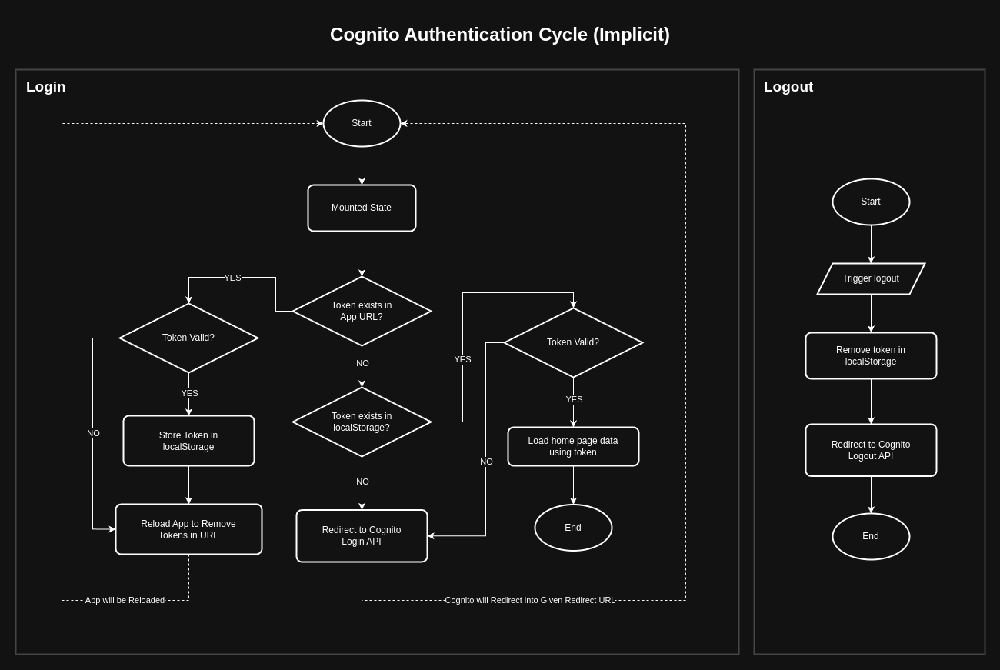

# Cognito Authentication Cycle (Implicit)



## Content Summary

- Authentication
  - [Login with Cognito](#login-with-cognito)
  - [Logout from Cognito](#logout-from-cognito)
- Token Existence
  - [App Mounted State](#mounted-state)
    - [Check Token in App URL](#check-token-in-app-url)
    - [Check Token in localStorage](#check-token-in-localstorage)
- Validation
  - [Token Validation](#token-validation)

## Login with Cognito

Cognito is a separated hosted UI to enter user credentials provided by AWS (Amazon Web Services). Once we were able to login or sign up successfully, Cognito will redirect us back to our React application with generated access token.

If we don't have an access token, we have to redirect into the Cognito UI. To do this, we should understand the options that provided to the Cognito login URL.

Look at the following Cognito login API example URL.

```
https://sample-user-pool.auth.sample-region.amazoncognito.com/login?client_id=sample-client-id&response_type=token&scope=email+openid+profile&redirect_uri=http://localhost:3000
```

This URL contains following specific options.

- `user_pool` - Identifier of users collection defined in AWS
- `aws_region` - AWS region
- `client_id` - Identifier of Cognito client
- `response_type` - How should we receive the authentication data
- `scope` - Which info are we requesting from user
- `redirect_uri` - Where to redirect after successfully logged in

Therefore, we have the standard format of Cognito login URL as follows

```
https://[user_pool].auth.[aws_region].amazoncognito.com/login
  ?client_id=[client_id]
  &response_type=[response_type]
  &scope=[scope]
  &redirect_uri=[redirect_uri]
```

To generate a Cognito login URL properly, we can use the following steps.
Then we can redirect to that url to handover the authentication to Cognito.

```js
// define cognito options
const user_pool = "sample-user-pool"
const aws_region = "sample-region"
const client_id = "sample-client-id"
const response_type = "token"
const scope = "email openid profile"
const redirect_uri = "http://localhost:3000"

// create cognito endpoint
const loginEndpoint = `https://${user_pool}.auth.${aws_region}.amazoncognito.com/login`

// create login params
const loginParams = new URLSearchParams({
  client_id, response_type, scope, redirect_uri
})

// redirect to cognito login
window.location.href = loginEndpoint + "?" + loginParams.toString()
```

## Logout from Cognito

When we have already logged in with the Cogito, we can logout from it anytime we need. To Do this, we have to clear the access token we have stored in our application localStorage and redirect into Cognito logout API.

First, we can clear the token from `localStorage`.

```js
localStorage.removeItem("token")
```

Then we have to redirect in to Cognito.
Look at the following Cognito logout API example URL.

```
https://sample-user-pool.auth.sample-region.amazoncognito.com/logout?client_id=sample-client-id&logout_uri=http://localhost:3000
```

This URL contains following specific options.

- `user_pool` - Identifier of users collection defined in AWS
- `aws_region` - AWS region
- `client_id` - Identifier of Cognito client
- `logout_uri` - Where to redirect after the logout

Therefore, we have the standard format of Cognito logout URL as follows

```
https://[user_pool].auth.[aws_region].amazoncognito.com/logout
  ?client_id=[client_id]
  &logout_uri=[logout_uri]
```

To generate a Cognito logout URL properly, we can use the following steps.
Then we can redirect to that url to handover the authentication to Cognito.

```js
// define cognito options
const user_pool = "sample-user-pool"
const aws_region = "sample-region"
const client_id = "sample-client-id"
const logout_uri = "http://localhost:3000"

// create cognito endpoint
const logoutEndpoint = `https://${user_pool}.auth.${aws_region}.amazoncognito.com/logout`

// create logout params
const logoutParams = new URLSearchParams({
  client_id, logout_uri
})

// redirect to cognito logout
window.location.href = logoutEndpoint + "?" + logoutParams.toString()
```

## Mounted State

In this section we will be able to understand how we should proceed with given flowchart, step by step to complete the authentication cycle.

`useEffect` with an empty dependency array can be used as the mounted is moment of the application.

```js
useEffect(() => {
  // app has mounted
}, [])
```

When the app is `mounted` we have to check the following possibilities before continue.
- If an `access token` is available in current `app URL`?
- If an `access token` available in `localStorage` and `valid`?
- If an `access token` is `not available` in anywhere?

According to the current status we can continue to complete the authentication or load the home page if a valid token is available.

From the previously given three situations, we may need to do following steps in order:

- Token in App URL ➛ [Check Token in App URL](#check-token-in-app-url)
- Token in localStorage ➛ [Check Token Validation](#check-token-validation)
- Token not available ➛ [Login with Cognito](#login-with-cognito)

## Check Token in App URL

When Cognito authentication is completed from [login](#login-with-cognito), its hosted UI redirects us back to our React application with the access token. Therefore, we can read the token from url `hash` and store it in `localStorage` for later use.

First, we have to check the `access_token` existence in url.

```js
// check if token is in url hash
const isTokenInURL = window.location.hash.includes("access_token")
```

Then we can read the access token from hash and store in `localStorage`.
Also make sure the token we read is a [valid token](#token-validation).

```js
// get url hash as url params
const params = new URLSearchParams(window.location.hash.replace("#", "?"))
// get access token from params
const token = params.get("access_token")
// check token validation
if (isTokenValid(token)) {
  // store in localStorage
  localStorage.setItem("token", token)
}
```

Then we have to reload the app to clear the tokens from url. Otherwise user can see that token and unusual lengthy url, which can be effect to user experience.

```js
window.location.href = window.location.pathname
```

## Check Token in localStorage

We can read the previously stored token in `localStorage` as below.

Then we have to [validate the token](#token-validation) before continue to use it.

```js
// get token from localStorage
const token = localStorage.getItem("token")
// check token validation
if (isTokenValid(token)) {
  // load home page data
} else {
  // redirect to Cogito login
}
```

If the token is valid we can use it to load the home page data from various APIs. Otherwise we have to redirect our app into [Cognito login API](#login-with-cognito)

## Token Validation

We can check the token validation from few steps. This is a client side validation to check the basic status of the access token.

- If token a `string`?
- Then, if token can be separated to `three parts` by splitting from dot (.)
- Then, if the token `expiration time` has not exceeded.

All above checks should be done in that order and if every validation has succeed, we can say the token we have is a valid token.


We can check if the token is a string as below.

```js
const isTokenString = typeof token === "string"
```

Token is created from combining tree parts.
  - Header (Encoded string with token generated information)
  - Payload (Encoded string with token information)
  - Signature (Hashed string for server-side validation)


We may have some information about the token inside the token payload.

First, we can split the token by dot (.) and check if the created array has three parts.

```js
// split token parts
const tokenParts = token.split(".")
// check token parts count
const hasThreeParts = tokenParts.length === 3
```

Then we can get the token payload, the middle part of the token and decode it.

```js
// decode token
const tokenPayload = JSON.parse(window.atob(tokenParts[1]))
// log token payload to see whats inside
console.log(tokenPayload)
```

Now this `tokenPayload` should be an `object` as below.

```json
{
    "sub": "a97a95ac-5011-7055-11b6-3aa689e244fe",
    "iss": "https://cognito-idp.ap-southeast-1.amazonaws.com/ap-southeast-1_dIqyGMEkI",
    "version": 2,
    "client_id": "5is7m8qlgsk60m7seu3sfqnune",
    "event_id": "607900d4-97cd-47d8-b288-b6f3864e61f5",
    "token_use": "access",
    "scope": "openid profile email",
    "auth_time": 1738031501,
    "exp": 1738035101,
    "iat": 1738031501,
    "jti": "d3a0210b-2a30-4caa-8c92-383d51c835a2",
    "username": "a97a95ac-5011-7055-11b6-3aa689e244fe"
}
```

As we can see `iat` is the token issued time and `exp` is the token expiration time. These timestamps are generated from the server-side, according to the standard Greenwich timing.

We can get the current timestamp by using following command

```js
const currentTime = Date.now()
```

Now this `currentTime` returns a valid with `13 digits` (including milliseconds) and the `exp` only has `10 digits`. That's because server-side generated timestamps are only calculated to the `seconds` most of the time.

Therefore, we can check if the token has expired by following logic.
Current time should have exceeded `exp` in the token to say the token is expired.

```js
// convert token time to milliseconds
const tokenExpTime = tokenPayload.exp * 1000
// compared with current time
const isTokenExpired = tokenExpTime < Date.now()
```

Therefore, if the `isTokenExpired` is `false`, we have a valid token to continue.
